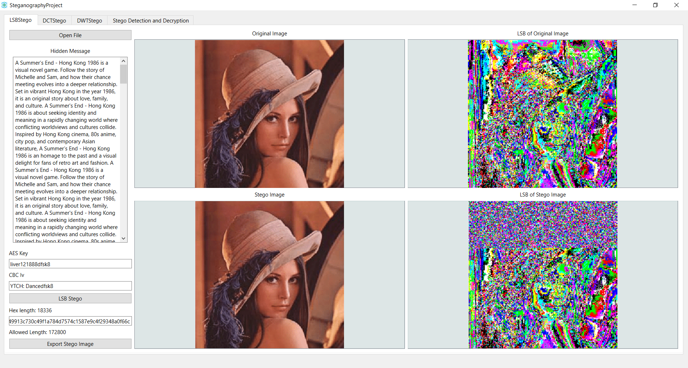
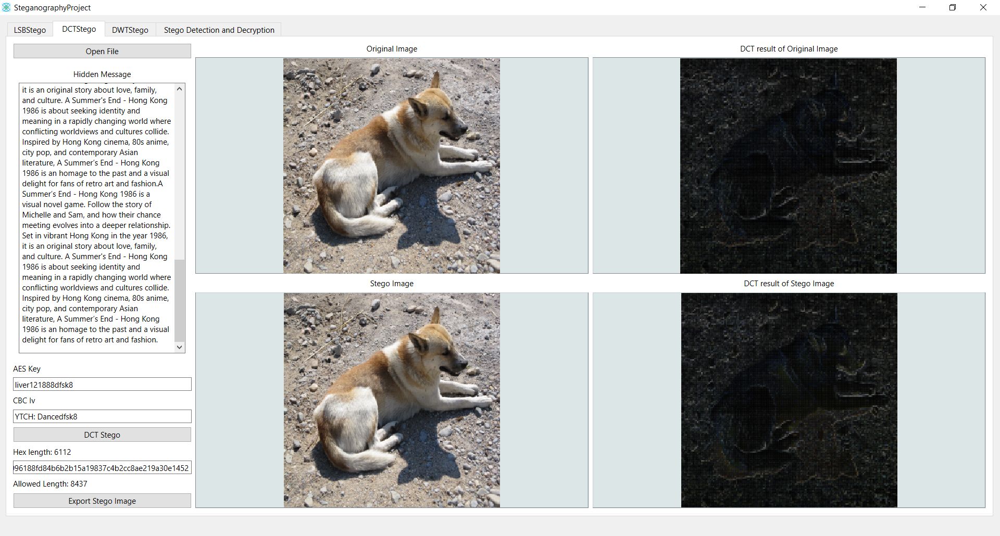
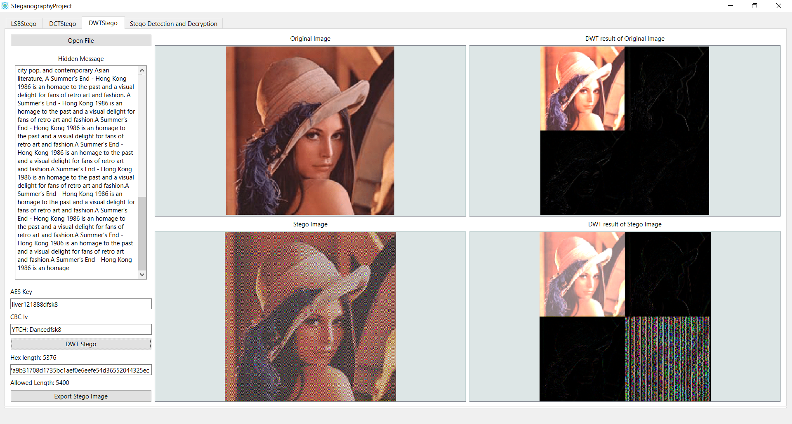
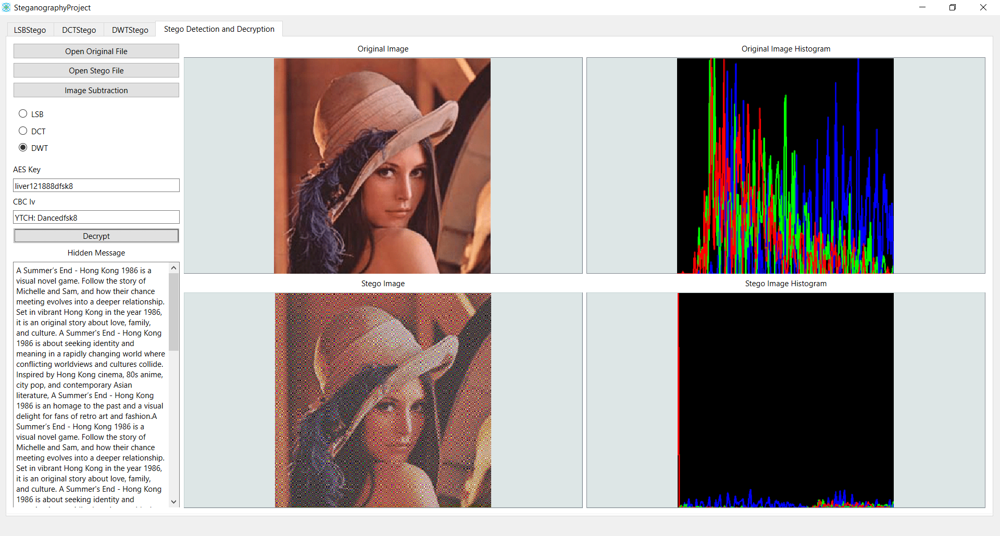
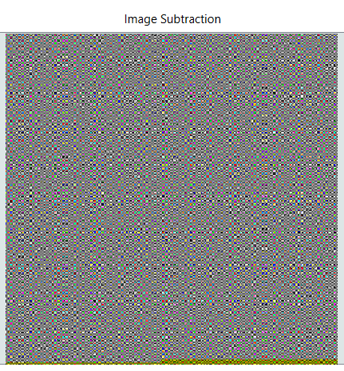

**Steganography encrypting and decrypting*** 

Li-Wei Yang, supervisor: Ta-Te Lin 

**ABSTRACT***   

Image steganography has been used in many area. In this paper, we propose a well-organized steganography application to do various method of steganography. The encrypting part of the application would include LSB steganography, DCT steganography, and DWT steganography; the hidden message would be encrypted with an AES key in 16 char as well as an IV (initial vector) for block cypher. The decrypting part of the application would include not only the decryption part with key and IV, but also some of the famous strategies used to detect steganography, such as histogram examination, image subtraction. 

**Keywords:** Image Steganography, Stego file, AES128, Block cypher, Cryptology, DCT, DWT 

1. **INTRODUCTION**  

Most of the research regarding steganography do not provide a user-friendly interface: most of them are in command-line tools. In addition, most of the steganography research do not encrypt the message for the sake of simplicity. This research proposed a well-organized UI as well as customize encryption keys, hoping to bridge the gap between research and the application of steganography.  

2. **METHODS** 
1. **User interface**  

The user interface is quite straightforward (Figure 1): the user can use tab to switch between different steganography methods, and for the last part the user can examine a stego image or decrypt it. For the LSB stego part, the LSB plane of the original image and the stego image are extracted to show that the method works. The user can export the stego image in PNG format and send the image to others. The stego image looks indistinguishable in human eyes. After the stego process, hex length should not exceed allowed length, otherwise the message may lost. 

Figure 2. User interface of LSB steganography. 

Figure 2. User interface of DCT steganography. 

For DWT steganography, the steganography process is visible to human eyes, future improvements are required. 

Figure 3. User interface of DWT steganography. 

For detection and decryption part, the user can choose the corresponding decrypting method to decrypt the hidden message, using the same key and IV as before. The user not only can see the histogram of the image to find anomaly, but also could do image subtraction to know that the image is a stego image. 

Figure 4. User interface of steganography detection and decryption; the user can show the subtraction result at upper-right by holding the Image Subtraction button. 

2. **Application block diagram** 

The hidden message is first turn into hex, then embedded into the image. The stego image can later be decrypted to obtain the hidden message, or be examined by steganography detecting techniques. 

3. **Encryption method** 

The encryption of the plain text is using AES-128, that is, encryption with a 16 bytes key and initial vector. The encryption implementation we used is Crypto++ library. AES-128 is a highly secure encryption method, the purpose of the encryption is to prevent others to find the plain text easily: even if they know how the embedded process of the steganography is and successfully extract the hex, they cannot decrypt it to know what the hidden message is. 

The detail of encryption is not the focus of this paper, but the AES encryption does permutation, XOR manipulation so the data is encrypted thoroughly. For more information, refer to reference link section. 

4. **LSB Steganography method**  

The Hidden message would first go through the encryption above to get a hex. The length of the hex would be shown in the UI, the length should never exceed the pixel number in the cover image. The hex is then turned into ASCII code, and the 7 bits code is separate to (3, 2, 2) bits. These bits would then be embedded into the LSB of the cover image in the order of (B, G, R), so the blue plane would experience a larger difference. After all the message is embedded, we add the ETX (ASCII code: 3) to notify the reader here is the End-of-Text, stop decrypting. The decrypting process is the reverse: we first extract the LSB of the stego image and turn them into hex, stop decrypting when decrypts out a ETX. The hex would be decrypted using the secret key and the IV exchanged privately by the sender and the receiver beforehand (here, we just copy-and-paste it from different tab), then the hidden message can be obtained. 

5. **DCT Steganography method** 

DCT Steganography method is robust when it comes to jpg format. Jpg format compress the image using DCT, so the message stored in the LSB would distorted. DCT Steganography embedded hidden message in DCT coefficients so the jpg compression process cannot destroy the hidden message. In the application, after we get the hex, we first separate the image in to 8\*8 blocks, then DCT the blocks. We represent the hidden message into bits in eight, then embed the bits sequentially. We operate on the DCT coefficient at a = (6, 7), b = (5, 1); if the bit is one, we make a>b by interchange a and b, if necessary; if it is zero, we make b>a. We then offset a and b by a magnitude d, d = (intensity-abs(b-a))/2, where intensity is a preset number (we use 100), to make the difference larger, making sure the message survives. Because most of the energy of the block is concentrated at the NW corner of the DCT coefficients, the changed coefficient would not cause the block to change a lot. Then, we IDCT the DCT coefficients to get the stego image. The decryption of the message is the reverse process of the encryption. 

6. **DWT Steganography method** 

DWT Steganography method is not as good as DCT. After we get the hex, we represent the hidden message into bits in eight, then embed the bits sequentially. We operate on the HH subband of DWT, the image should not change too much because the HH subband is the detail part of the image; if the bit is one, we make the coefficient plus a value, alpha (we use 200); if the bit is zero, we make the coefficient minus alpha. The value of alpha must be large, to make sure the message survives. After the embedding process, we IDWT the DWT coefficients to get the stego image. The decryption of the message is the reverse process of the encryption. 

7. **Steganography detection method** 

For steganography detection method, we propose image subtraction and histogram examination. These two are the most common detection method used nowadays. Some steganography process may embed certain bit to balance the histogram, evades the histogram examination, but the image subtraction can still tell the difference between the stego and the original image. As a result, never use online photo as cover image or do not leak the cover image out is the best way to prevent such detection. 

3. **EXPERIMENTAL RESULTS** 

The figure below shows the result of LSB steganography. We can see that stego image has noise in the embedded region, but the appearance of the image remain indistinguishable compared to the original image. 

Figure 5. LSB steganography result. 

The figure below shows the detection of LSB steganography. We can see that stego image has a lot of discrete jump in histogram, especially in R plane. At first we think the blue plane should be nosier, but we latter find out that because the R plane store the 2 LSB of hidden message, and it basically change when the parity of the number change, whereas the change in MSB in B plane is harder to achieve. On the right is the result of image subtraction. We can see the upper part of the image is corrupted by the hidden message. 

Figure 6. LSB steganography detection. 

The figure below shows the result of DCT steganography. We use a 200\*200 image for better visualization of our coefficients modification. We can see at such scale, the stego image show some contour noise obviously. Besides, we can see the DCT result of images are different from others, because the embedding process may cause the energy of that blocks surge, so some blocks show high intensities. 

Figure 7. DCT steganography result. 

For DCT steganography detection, the histogram is indistinguishable, but the subtraction method sees the difference obviously. If we zoom in the image, we should see the stego image is corrupted. 

Figure 8. DCT steganography detection. 

For DWT steganography, the stego image is deteriorated so badly that the stego image is distinguishable in human eyes. Future study would concentrated at prevent this visibility. 

Figure 9. DWT steganography result. 

For DWT steganography detection, the histogram of stego image is deteriorated that the B channel of the image is zeroed. And the subtraction of images can see the R channel is embedded. But the encryption should keep the message safe. 

Figure 10. DCT steganography detection. 

4. **CONCLUSION** 

The DWT method still has a lot of improvement. At first we tried the method mentioned in [6], but the result is also not ideal. In addition, the robustness of the encryption and decryption still needs improvement. If the hex length or the key and Iv is incorrect, the application crashes. After multiple times of experiment, real picture (IP\_dog.bmp) success most of the time, other cover image may fail to carry the hidden message successfully. We think this is because the image is taken in a natural setting, so the histogram is more even, and thus it is more robust for carrying message. The proposed method integrate the creation and detection of steganography image, and provides other people a platform to step into this paradigm. 

**REFERENCE LINKING**  

Websites:  [1] “AES Explained (Advanced Encryption Standard) - Computerphile”

[https://youtu.be/O4xNJsjtN6E ](https://youtu.be/O4xNJsjtN6E)(22 November 2019). 

2. “Almost All Web Encryption Works Like This (SP Networks) – Computerphile” [https://youtu.be/DLjzI5dX8jc ](https://youtu.be/DLjzI5dX8jc)(14 August 2019). 
2. “Secrets Hidden in Images (Steganography) - Computerphile” [https://youtu.be/TWEXCYQKyDc ](https://youtu.be/TWEXCYQKyDc)(4 May 2015).  
2. “RoliSoft / Steganography”  [https://github.com/RoliSoft/Steganography(](https://github.com/RoliSoft/Steganography)10 Jan 2016). 

**REFERENCES** 

1. Lin Y-K. A data hiding scheme based upon DCT coefficient modification. Computer Standards & Interfaces. 2014;36. 
1. Channalli S, Jadhav A. Steganography An Art of Hiding Data. arXiv pre-print server. 2009. 
1. Mazumder JA, Hemachandran K. Study of Image steganography using LSB, DFT and DWT. INTERNATIONAL JOURNAL OF COMPUTERS & TECHNOLOGY. 2013;11(5):2618-27. 
1. Baby D, Thomas J, Augustine G, George E, Michael NR. A Novel DWT Based Image Securing Method Using Steganography. Procedia Computer Science. 2015;46:612-8. 
1. Chaitanya C, Reddy CN, Vignesh KS, Krishna PR, Roshini A, Swetha K, editors. Enhanced Hash Based Image Steganography Technique to Increase Data Integrity and Confidentiality2021: IEEE. 
1. S. Kumar and S. K. Muttoo, "Data Hiding Techniques Based on Wavelet-like Transform and Complex Wavelet Transforms," 2010 International Symposium on Intelligence Information Processing and Trusted Computing, 2010, pp. 1-4, doi: 10.1109/IPTC.2010.46. 
